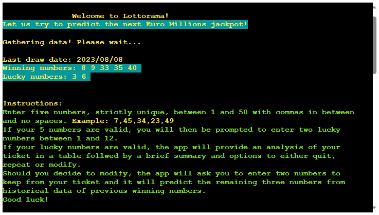
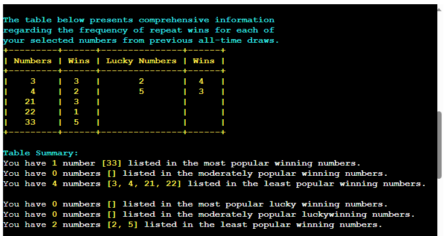
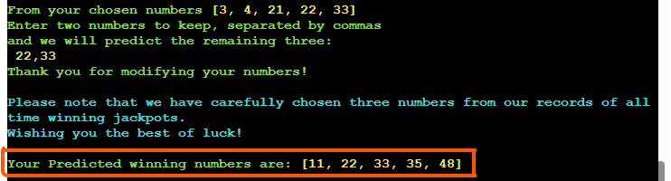
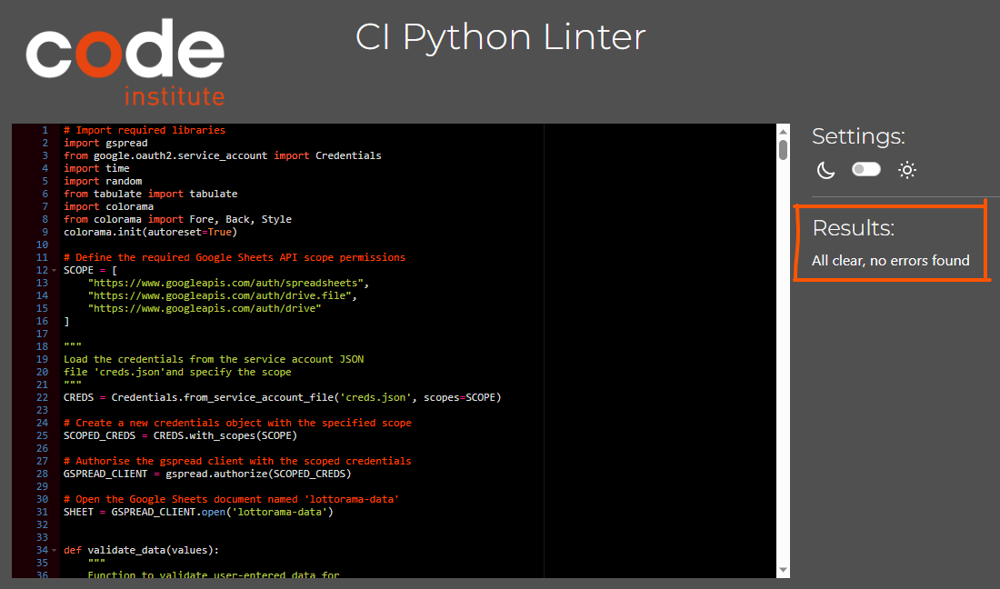
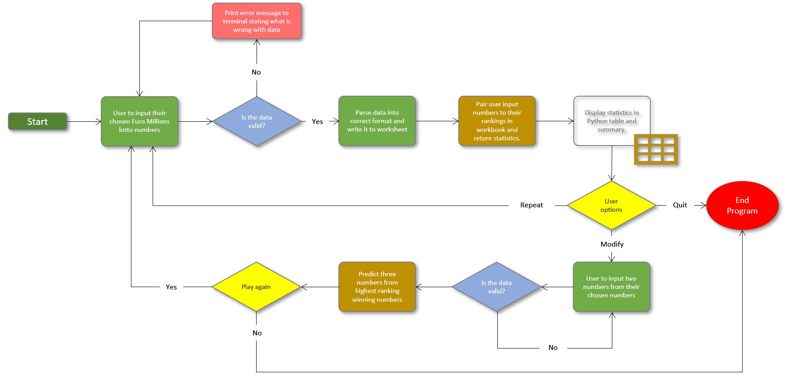
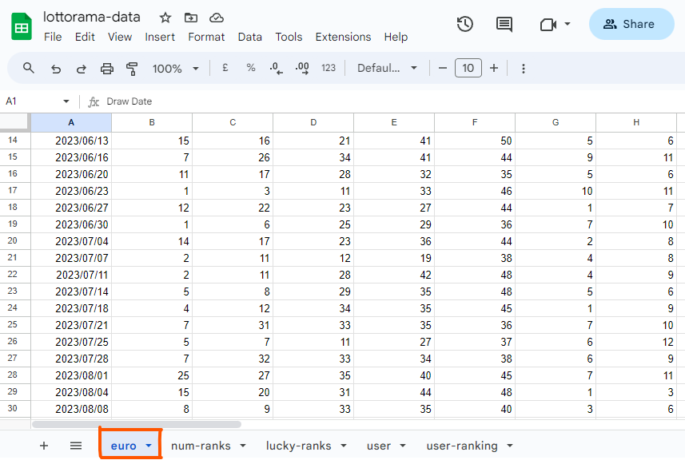
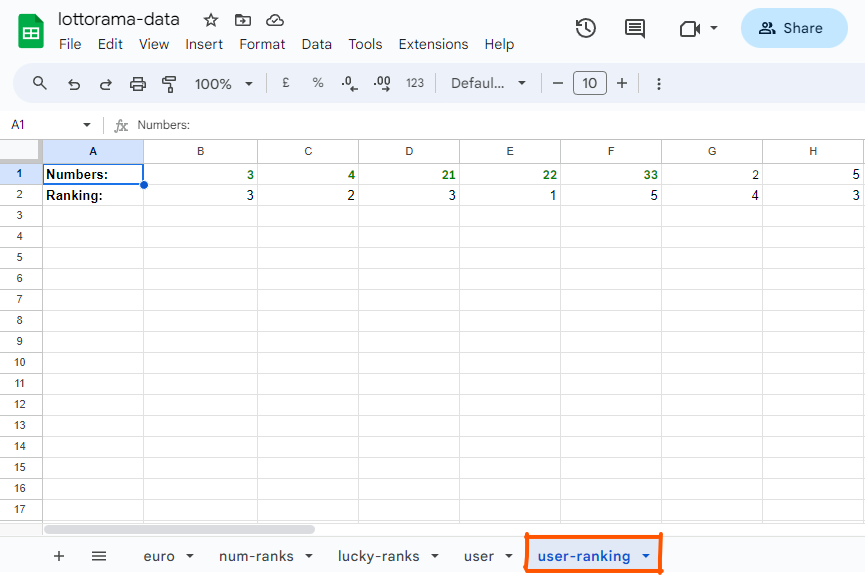

# Lottorama - Lottery Prediction and Analysis Tool

Lottorama is a Python-based tool that helps users analyee historical lottery data and make predictions for future lottery numbers. Lottorama interacts with a Google Sheets document to provide insights into winning numbers, frequency of occurrence, and offers users the option to modify and predict their own numbers for upcoming draws.

**[Live site](https://lottorama-d338fc131061.herokuapp.com/)**

------------------------------------------------------------------

**[Repository](https://github.com/jjsemaan/lottorama/)**

------------------------------------------------------------------

## Features

1. The opportunity to get winning numbers of the most recent Euro Millions draw.
    - When the program is first run a welcome note is displayed followed by the latest winning numbers and app usage instructions.

2. Validates user-entered Euro Millions ticket numbers.
    - Checks if numbers are whole numbers.
    - Checks if numbers are five in total for lotto and two in total for lucky numbers.
    - Checks if numbers are between 1 and 50 for lotto and between 1 and 12 for lucky numbers.
    - Checks if numbers are unique.
    - Checks for letters, spaces and / or multiple commas and returns error.

3. Displays statistics about the frequency of past wins for user-selected numbers.
    - Returns the number of times each number appeared in a winning draw.

4. Provides options to modify user-selected numbers and predict new combinations.

5. Generates predictions for future lottery numbers based on historical data.
    - Requests user to keep two numbers while app predicts the remaining three by collecting highest and moderate ranking numbers.
    - Then the app picks two numbers from highest ranking and one number from the moderate ranking collections.

6. Offers an interactive and user-friendly command-line interface.

7. Utilises Google Sheets API for data storage and retrieval.

## Technologies

* Python was used as the programming language to make the game.
* Microsoft Power Point was used to create the flow chart showing the game's logic.
* [GitHub](https://github.com/) has been used to store the code, images, and other content. 
* [Heroku](https://dashboard.heroku.com/apps) was used to deploy the game to the web.
* [Git](https://git-scm.com/) was used to track changes made to the project and to commit and push code to the repository.
* Python module [time](https://docs.python.org/3/library/time.html) was used to allow for a delay when acquiring data from Google Sheets. 
* Python module [random](https://docs.python.org/3/library/random.html) was used to select numbers from a list of highest ranking and moderate ranking numbers. 
* Python library [tabulate](https://pypi.org/project/tabulate/) was installed and used to create a table with analytics of winning numbers.
* Python library [colorama](https://pypi.org/project/colorama/) was installed and used to add colors to text throughout the app.
* Python library [gspread](https://pypi.org/project/gspread/) was installed and used to read, write and update data, and connect with Google Sheets API.

## Testing

### Validator testing

No errors were found when code passed through the [PEP8](http://pep8online.com/checkresult) linter.

### Bugs / Other

I manually tested the whole app going back and forth through every iteration, using the below workflow chart for reference:

## Testing

The app is connected to a Google Sheets document named 'lottorama-data' through the Google Sheets API. The connection is tested by retrieving and pushing information to the document.

1. **Retrieving Information:** The app successfully retrieves data from the 'euro' workbook to display the last draw date, winning numbers, and lucky numbers.

2. **Pushing Information:** The app pushes user-entered Euro Millions ticket numbers to the 'user' workbook and ranks the user numbers in the user-ranking workbook before retrieving the analysed numbers to the app.

### Functions Testing

1. **`validate_data(values)`:** This function is responsible for validating user-entered Euro Millions ticket numbers. Testing includes:
   - Providing valid and invalid number combinations to check for accurate validation.

2. **`user_lotto_data()`:** This function is responsible for obtaining user input for Euro Millions ticket numbers. Testing includes:
   - Entering correct and incorrect formats of ticket numbers.
   - Verifying user prompts and feedback during the process.

3. **`push_to_user_workbook(lotto_data)`:** This function pushes user-entered Euro Millions ticket numbers to the 'user' workbook. Testing includes:
   - Checking if the data is correctly pushed to the workbook.
   - Ensuring that the data is correctly formatted.

4. **`play_lottorama_game()`:** This function handles the main gameplay loop. Testing includes:
   - Simulating the user input process for Euro Millions ticket numbers.
   - Testing modifications of user-selected numbers and predictions.
   - Testing the options to quit or repeat the game.

## Deployment

The below steps were followed to deploy this project to Heroku:
1. Go to [Heroku](https://dashboard.heroku.com/apps) and click "New" to create a new app.
2. After choosing the app name and setting the region, press "Create app".
3. Go to "Settings" and navigate to Config Vars. Add a Config Var with a key word of called PORT and a value of 8000.
4. Still in the "Settings", navigate to Buildpacks and add buildpacks for Python and NodeJS (in order).
5. Leave "Settings" and go to "Deploy". Scroll down and set Deployment Method to GitHub.
Once GitHub is chosen, find your repository and connect it to Heroku.
6. Scroll down to Manual Deploy, make sure the "main" branch is selected and click "Deploy Branch". 
7. The deployed app can be found [here](https://lottorama-d338fc131061.herokuapp.com/).

## Credits

> The mock terminal used to host the game has been created by Code institute.
>  

> General python code lookup from W3 Schools "https://www.w3schools.com/python/"
>  

> Code Institute Love sandwiches Project developed inline with PP3 "https://github.com/Code-Institute-Solutions/love-sandwiches-p5-sourcecode/tree/master/01-getting-set-up/01-getting-our-gitpod-workspace-set-up"
>  

> The code is custom and written entirely by Jalal Semaaan.

## Acknowledgements

> Daisy McGirr
> 
> My mentor who provided me with constructive feedback and support throughout the duration of this project.

